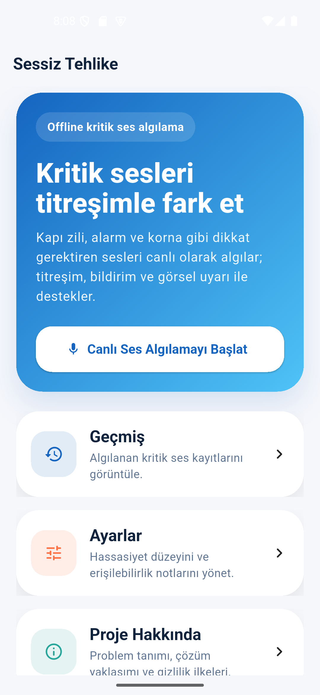

# Sessiz Tehlike
> İşitme engelli ve ağır işiten bireyler için kritik çevresel sesleri titreşim, bildirim ve görsel alarm ile fark edilir hale getiren offline-first Flutter uygulaması.

**Hazırlayan:** Mehmet Altıok  
**Öğrenci No:** 23080410319  
**Çalışma Tipi:** Bireysel  
**Hedef Platform:** Android

[]()
[]()
[]()
[]()
[]()

## Demo


Ek demo çıktısı: [docs/demo.gif](docs/demo.gif)

## Neden Bu Uygulama?
İşitme engelli ve ağır işiten bireyler için bazı sesler yalnızca çevresel bir uyarı değil, doğrudan güvenlik sinyalidir. Kapı zili, yangın alarmı, korna veya ani yüksek sesler fark edilmediğinde kullanıcı hem günlük yaşam akışında hem de güvenlik açısından dezavantaj yaşayabilir. Sessiz Tehlike, mobil cihazın mikrofon, titreşim, local notification ve offline çalışma yeteneklerini birlikte kullanarak bu problemi erişilebilir bir mobil çözüm haline getirir.

## Değer Önermesi
Telefonunu yanında taşıyan kullanıcı için çevresel kritik sesleri görünür ve hissedilir hale getirir. Uygulama eşik aşımında sesin kendisini kaydetmez; yalnızca dB seviyesi, sınıflandırılmış ses tipi ve zaman bilgisini cihaz içinde tutar.

## Hedef Kullanıcılar
- İşitme engelli bireyler
- Ağır işiten bireyler
- Yalnız yaşayan kullanıcılar
- İşitme engelli bireylerin yakınları
- Ev, yurt, okul ve kampüs ortamında çevresel uyarıları kaçırmak istemeyen kullanıcılar

## Problem Özeti
- Kullanıcı kritik çevresel sesleri her zaman fark edemeyebilir.
- Özellikle kısa süreli uyarılar kolay kaçabilir.
- Mevcut genel amaçlı desibel ölçer uygulamalarının çoğu erişilebilir alarm akışına odaklanmaz.
- Donanım tabanlı akıllı ev çözümleri ek maliyet gerektirir.

## Çözüm Özeti
Sessiz Tehlike canlı dB ölçümü yapar ve kullanıcı belirlediği eşik aşıldığında:
- güçlü titreşim verir,
- yerel bildirim gösterir,
- renk tabanlı görsel alarm üretir,
- olayı cihaz içi veritabanına kaydeder.

Bu yaklaşım sayesinde kullanıcı çevresel sesi duymasa bile dokunsal ve görsel kanallarla uyarı alır.

## Özellikler
- Mikrofon ile canlı dB ölçümü
- Büyük dairesel dB göstergesi
- dB düzeyine göre renk değiştiren alarm alanı
- Ayarlanabilir ses eşiği
- Eşik aşımında titreşim
- Eşik aşımında local notification
- Kritik olayların sqflite ile cihaz içine kaydedilmesi
- Geçmiş ekranında kayıtların listelenmesi
- Geçmiş temizleme özelliği
- Ayarlar ekranından hassasiyet güncelleme
- Hakkında ekranında problem, çözüm ve gizlilik açıklaması
- Semantics destekli erişilebilir arayüz
- Ses kaydı tutmadan offline çalışma

## Ekranlar
### Home Screen
- Modern karşılama ekranı
- Mavi hero kart
- Canlı algılamaya geçiş
- Geçmiş, Ayarlar ve Proje Hakkında kartları

### Live Detector Screen
- Mikrofon ile gerçek zamanlı dB takibi
- Büyük ve renkli dB göstergesi
- Eşik ayar slider’ı
- Başlat / Durdur kontrolü
- Kritik seviyede titreşim, bildirim ve kayıt

### History Screen
- Ses tipi, dB değeri ve tarih-saat bilgisi listesi
- Geçmişi temizleme

### Settings Screen
- Ses hassasiyeti ayarı
- Erişilebilirlik notları
- Büyük ve sade tasarım

### About Screen
- Problem tanımı
- Çözüm yaklaşımı
- Gizlilik bilgisi
- Ses kaydı tutulmadığına dair açık beyan

## Kullanılan Teknolojiler
- Flutter
- Provider
- GoRouter
- permission_handler
- noise_meter
- vibration
- flutter_local_notifications
- sqflite
- path
- intl

## Teknik Mimari
- Framework: Flutter
- State management: Provider
- Routing: GoRouter
- Local database: sqflite
- Notifications: flutter_local_notifications
- Permissions: permission_handler
- Sound level measurement: noise_meter
- Haptic feedback: vibration
- Data approach: offline-first

## dB Sınıflandırma Mantığı
- `90+ dB` → Çok yüksek kritik ses
- `80+ dB` → Alarm / korna benzeri ses
- `70+ dB` → Kapı zili / yüksek ortam sesi
- `55+ dB` → Normal konuşma / ortam sesi
- `55 altı` → Sessiz ortam

## Mobil Teknik Derinlik
Bu proje yalnızca klasik bir CRUD uygulaması değildir. Mobilin kendine özgü yetenekleri bir arada kullanılmıştır:
- Mikrofon tabanlı anlık çevresel veri okuma
- Haptic feedback ile alternatif uyarı kanalı
- Local notification ile sistem seviyesinde kritik alarm
- Offline-first veri saklama
- Yerel veritabanı ile olay geçmişi

Bu nedenle çözüm doğrudan mobil cihazın sensör ve işletim sistemi kabiliyetlerinden beslenir.

## Önceki Haftaların Kullanımı

| Hafta | Konu | Projedeki Yeri | Dosya |
| --- | --- | --- | --- |
| Hafta 2 | Widget | Ana ekran, kart yapıları, buton bileşenleri | `lib/screens/*`, `lib/widgets/*` |
| Hafta 3 | Layout | Hero kart, kart yerleşimleri, büyük alanlı tasarım | `lib/screens/home_screen.dart`, `lib/screens/live_detector_screen.dart` |
| Hafta 4 | GoRouter | Sayfa yönlendirmeleri | `lib/router.dart` |
| Hafta 5 | Provider | Canlı dB durumu, eşik yönetimi, alarm akışı | `lib/providers/sound_provider.dart` |
| Hafta 7 | sqflite | Kritik ses geçmişini cihazda saklama | `lib/services/db_service.dart` |
| Hafta 8 | Offline-first | Verilerin cihaz içinde tutulması ve internet gerektirmemesi | `lib/services/db_service.dart` |
| Hafta 9 | Mikrofon | Gerçek zamanlı ses seviyesi takibi | `lib/providers/sound_provider.dart` |
| Hafta 9 | İzinler | Mikrofon ve bildirim izni yönetimi | `lib/services/permission_service.dart` |
| Hafta 9 | Bildirim | Kritik ses local notification akışı | `lib/services/notification_service.dart` |
| Hafta 9 | Titreşim | Eşik aşımında haptic uyarı | `lib/providers/sound_provider.dart` |

## Erişilebilirlik (a11y)
- `Semantics(label: ...)` kullanılan butonlar ve giriş kartları
- Minimum 48dp dokunma alanına uygun büyük buton yaklaşımı
- Açık arka plan ve kontrastlı vurgu renkleri
- Kritik uyarılarda çoklu kanal kullanımı: görsel + titreşim + bildirim
- Sade bilgi mimarisi ve az katmanlı gezinme

Not: Uygulama erişilebilirlik prensiplerine göre geliştirilmiştir. TalkBack/VoiceOver ile gerçek cihaz testi teslim öncesi ayrıca yapılmalıdır.

## Gizlilik
- Uygulama ses kaydı tutmaz.
- Yalnızca ses tipi, dB değeri ve zaman bilgisi cihaz içinde saklanır.
- Veriler uzak sunucuya gönderilmez.
- Kullanıcı mahremiyeti için ham ses verisi saklanmaz.

## Kullanıcı Araştırması
Detaylı notlar için [docs/user-research.md](docs/user-research.md) dosyasına bakılabilir.

Öne çıkan bulgular:
- Kısa süreli ama kritik seslerin kaçırılması ciddi sorun yaratıyor.
- Yakınlar offline çalışan bir çözümü daha güven verici buluyor.
- Kullanıcılar farklı ortamlar için ayarlanabilir hassasiyet bekliyor.

## Rakip ve Farklılaşma

| Rakip Türü | Eksik Nokta | Sessiz Tehlike Farkı |
| --- | --- | --- |
| Genel dB ölçer uygulamaları | Erişilebilir alarm akışı zayıf | Titreşim + bildirim + görsel alarm birlikte |
| Akıllı ev çözümleri | Ek donanım ve maliyet gerektirir | Sadece telefon ile çalışır |
| Giyilebilir cihaz tabanlı çözümler | Ek cihaz bağımlılığı vardır | Tek cihaz, düşük bariyerli kullanım |

## Proje Yapısı
```text
lib/
 ├─ main.dart
 ├─ router.dart
 ├─ models/
 │   └─ alert_record.dart
 ├─ providers/
 │   └─ sound_provider.dart
 ├─ services/
 │   ├─ db_service.dart
 │   ├─ notification_service.dart
 │   └─ permission_service.dart
 ├─ screens/
 │   ├─ home_screen.dart
 │   ├─ live_detector_screen.dart
 │   ├─ history_screen.dart
 │   ├─ settings_screen.dart
 │   └─ about_screen.dart
 └─ widgets/
     ├─ app_card.dart
     └─ primary_button.dart
```

## Kurulum
```bash
cd D:\sessiz_tehlike
flutter pub get
flutter analyze
flutter test
flutter run
```

## Doğrulama
Projede aşağıdaki doğrulamalar yapılmıştır:
- `flutter pub get`
- `flutter analyze`
- `flutter test`
- Android emülatörde `flutter run`

## Test Edilen Ortam
- Android Emulator: `sdk gphone64 x86 64`
- Windows geliştirme ortamı

## Teslim Kontrol Listesi
- [x] GitHub için README hazır
- [x] Repo kökünde `PRD.md` var
- [x] Repo kökünde `README.md` var
- [x] `docs/user-research.md` mevcut
- [x] Uygulama `flutter run` ile açılıyor
- [x] Demo görseli eklendi
- [x] Hafta ispat tablosu eklendi

## Kaynaklar
- WHO, hearing loss fact sheet: [who.int](https://www.who.int/en/news-room/fact-sheets/detail/deafness-and-hearing-loss)
- T.C. Aile ve Sosyal Hizmetler Bakanlığı işitme erişilebilirliği haberleri: [aile.gov.tr](https://www.aile.gov.tr/haberler/ailem-isitme-engelliler-engelsiz-iletisim-merkezi-268-bin-719-cagriya-ceviri-destegi-sagladi/)

## PRD ve Detaylar
Tam ürün gereksinimleri belgesi için [PRD.md](PRD.md) dosyasına bakılabilir.

## Sonuç
Sessiz Tehlike, işitme engelli ve ağır işiten bireyler için gerçek bir günlük problemi mobil cihazın güçlü yönleriyle çözmeyi hedefleyen, erişilebilirlik ve gizlilik odaklı bir final projesidir. Mikrofon, titreşim, local notification, yerel veritabanı ve offline-first yaklaşımı aynı ürün içinde birleştirerek ders kapsamındaki haftalık kazanımları somut ve çalışır bir mobil uygulamaya dönüştürür.
